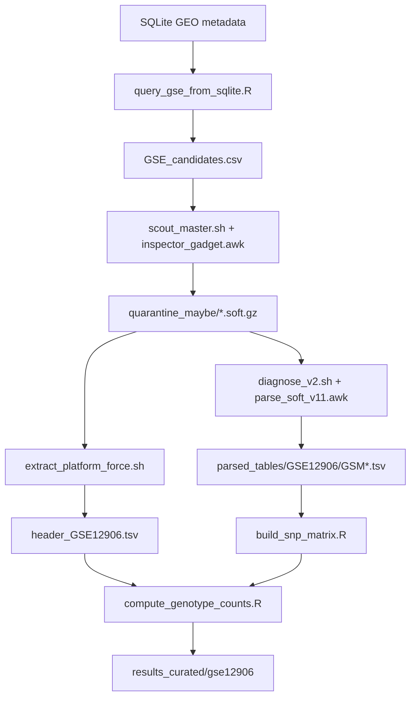

# HWE-LOH GSE12906 (Curated Forensic Pipeline)

Pipeline curado para reconstruir el flujo piloto de replicacion HWE-LOH con foco en `GSE12906`, versionado solo con logica de procesamiento y resultados curados ligeros.

## 1) Base teorica (paper)

- Referencia: Wilkins K, LaFramboise T. *Losing balance: Hardy-Weinberg disequilibrium as a marker for recurrent loss-of-heterozygosity in cancer* (2011), doi:10.1093/hmg/ddr422.
- Idea central: detectar deplecion de heterocigotos en SNPs para inferir senal de LOH recurrente.
- Alcance de este repo: replica operativa del pipeline de extraccion y preparacion de datos del piloto `GSE12906`.
- Limite explicito: no implementa una replica completa del test exacto + estimador MLE del paper.

## 2) Dependencias empleadas

### Sistema
- Git Bash o shell POSIX compatible.
- `bash`, `awk`, `curl`, `gzip` (`zcat`), `sed`.

### R
- R >= 4.2 recomendado.
- Paquetes: `DBI`, `RSQLite`, `data.table`.

Instalacion rapida en R:

```r
install.packages(c("DBI", "RSQLite", "data.table"))
```

## 2.1) Referencia de obtencion de datos (no versionados)

Este repo no almacena datasets masivos. Para reproducir, el usuario externo debe provisionar estos insumos en su propia ruta de trabajo.

- SQLite GEO metadata:
  - URL referencia: `https://www.ncbi.nlm.nih.gov/geo/info/geo_paccess.html`
  - Ruta esperada en este piloto: `F:/Documentos/UNMSM/TESIS/GEOmetadb.sqlite`
- SOFT de GSE12906:
  - URL referencia: `https://ftp.ncbi.nlm.nih.gov/geo/series/GSE12nnn/GSE12906/soft/`
  - Ruta esperada en este piloto: `F:/Documentos/UNMSM/TESIS/results/quarantine_maybe/GSE12906_family.soft.gz`

Las rutas y metadatos de entrada estan normalizados en:

- `manifiest/dataset_registry.tsv`
- `manifiest/files_expected.tsv`

## 3) Etapas del pipeline



### Etapa 1: identificacion de GSE desde sqlite

Script: `scripts/01_discovery/query_gse_from_sqlite.R`

Funcion:
- Consulta `GEOmetadb.sqlite` para recuperar series candidatas de SNP arrays en cancer.

Argumentos:
- `--sqlite-path PATH`
- `--out-csv PATH`
- `--keywords K1,K2,...` (opcional)

Input:
- SQLite GEO metadata.

Output:
- CSV de candidatos (`gse`, `title`, `experiment_type`, `gpl`, `platform_title`, etc.).

Tipo de datos output:
- Tabla tabular plana (`csv`).

### Etapa 1b: cribado de SOFT

Scripts:
- `scripts/01_discovery/scout_master.sh`
- `scripts/01_discovery/inspector_gadget.awk`

Funcion:
- Descarga SOFT por GSE y clasifica por presencia de tablas utiles.

Argumentos `scout_master.sh`:
- `--input-csv PATH`
- `--results-dir PATH`
- `--log-file PATH`
- `--awk-detector PATH`

Input:
- CSV de candidatos.

Output:
- `results/hits_confirmados/*.soft.gz`
- `results/quarantine_maybe/*.soft.gz`
- `results/cribado_reporte.csv`

Tipo de datos output:
- Archivos SOFT comprimidos + log CSV.

### Etapa 2: aislamiento de tablas utiles

Scripts:
- `scripts/02_extract/diagnose_v2.sh`
- `scripts/02_extract/parse_soft_v11.awk`

Funcion:
- Parsea bloques `!sample_table_begin` / `!sample_table_end` y separa tablas GSM en TSV.

Argumentos `diagnose_v2.sh`:
- `--source-dir PATH`
- `--out-dir PATH`
- `--awk-parser PATH`
- `--log-file PATH`

Input:
- `*.soft.gz` de cuarentena o hits.

Output:
- `results/parsed_tables/GSEXXXX/GSM*.tsv`
- Log de ejecucion.

Tipo de datos output:
- TSV por muestra GSM (con metadatos comentados + tabla de llamadas).

### Etapa 3: extraccion de header de plataforma

Script:
- `scripts/02_extract/extract_platform_force.sh`

Funcion:
- Extrae bloque `!platform_table` para anotacion SNP.

Argumentos:
- `--soft-file PATH`
- `--out-file PATH`

Input:
- SOFT comprimido.

Output:
- `header_GSE12906.tsv`.

Tipo de datos output:
- TSV de plataforma con columnas de anotacion (ID, RS, chromosome, position, etc.).

### Etapa 4: construccion de matriz de genotipos SNP-GWAS

Scripts:
- `scripts/03_build/build_snp_matrix.R`
- `scripts/03_build/compute_genotype_counts.R`

Funcion `build_snp_matrix.R`:
- Une tablas GSM por `ID_REF` y construye matriz SNP x muestra.

Argumentos:
- `--parsed-dir PATH`
- `--out-matrix PATH`
- `--gse-id GSE12906` (opcional)

Input:
- `GSM*.tsv` parseados.

Output:
- Matriz CSV SNP x muestra.

Tipo de datos output:
- CSV grande, una fila por SNP y columnas por GSM.

Funcion `compute_genotype_counts.R`:
- Calcula conteos `AA/AB/BB`, `n`, `p`, `q`, `H_exp`, `H_obs`.

Argumentos:
- `--matrix-csv PATH`
- `--out-counts PATH`
- `--platform-header PATH` (opcional)
- `--out-annot PATH` (opcional)
- `--map-mode auto|text|numeric123`

Input:
- Matriz SNP x muestra.
- Header de plataforma (opcional para merge).

Output:
- CSV de conteos y metricas de heterocigosidad.
- CSV anotado opcional.

Tipo de datos output:
- Tabla numerica por SNP.

### Etapa 5: validacion de resultados

Script:
- `scripts/04_qc/validate_outputs.R`

Funcion:
- Valida coherencia minima entre parseados, matriz y conteos.

Argumentos:
- `--parsed-dir PATH`
- `--matrix-csv PATH`
- `--counts-csv PATH`
- `--report PATH` (opcional)

Output:
- Resumen por consola y reporte markdown opcional.

## 4) Resultados

Resultados curados incluidos en git:

- `results_curated/gse12906/summary_metrics.tsv`
- `results_curated/gse12906/top_snps_preview.tsv`
- `results_curated/gse12906/pipeline_run_report.md`

Resultados grandes no versionados:

- `F:/Documentos/UNMSM/TESIS/GEOmetadb.sqlite`
- `F:/Documentos/UNMSM/TESIS/results/quarantine_maybe/GSE12906_family.soft.gz`
- `F:/Documentos/UNMSM/TESIS/results/parsed_tables/GSE12906`
- `F:/Documentos/UNMSM/TESIS/results/parsed_tables/GSE12906/header_GSE12906.tsv`
- `F:/Documentos/UNMSM/TESIS/HWE-LOH_assay/data/GSE12906_Genotype_Matrix.csv`
- `F:/Documentos/UNMSM/TESIS/HWE-LOH_assay/data/GSE12906_geno_counts_AA_AB_BB.csv`

La referencia de estos artefactos esta en:
- `manifiest/INVENTARIO_GRANDES_REFERENCIAS.tsv`
- `manifiest/dataset_registry.tsv`

## Demo GSE12906 (help-first)

```bash
bash examples/gse12906_demo/run_demo.sh
```

Tambien puedes consultar ayuda individual:

```bash
Rscript scripts/01_discovery/query_gse_from_sqlite.R --help
bash scripts/01_discovery/scout_master.sh --help
bash scripts/02_extract/diagnose_v2.sh --help
bash scripts/02_extract/extract_platform_force.sh --help
Rscript scripts/03_build/build_snp_matrix.R --help
Rscript scripts/03_build/compute_genotype_counts.R --help
Rscript scripts/04_qc/validate_outputs.R --help
```

## Ubicacion de datos esperada

Config base sugerida:

- `env/.env.example`
- `env/project_paths.yml`

Los scripts permiten rutas por argumentos CLI para no hardcodear.

## Forensic manifests

- `manifiest/MANIFIESTO_UNIDADES_ANALISIS.tsv`
- `manifiest/MAPA_RENOMBRES_COMPATIBILIDAD.tsv`
- `manifiest/INVENTARIO_GRANDES_REFERENCIAS.tsv`
- `manifiest/VALIDACION_LIGERA.md`
- `manifiest/PLAN_AISLAMIENTO_LOGICO.md`
